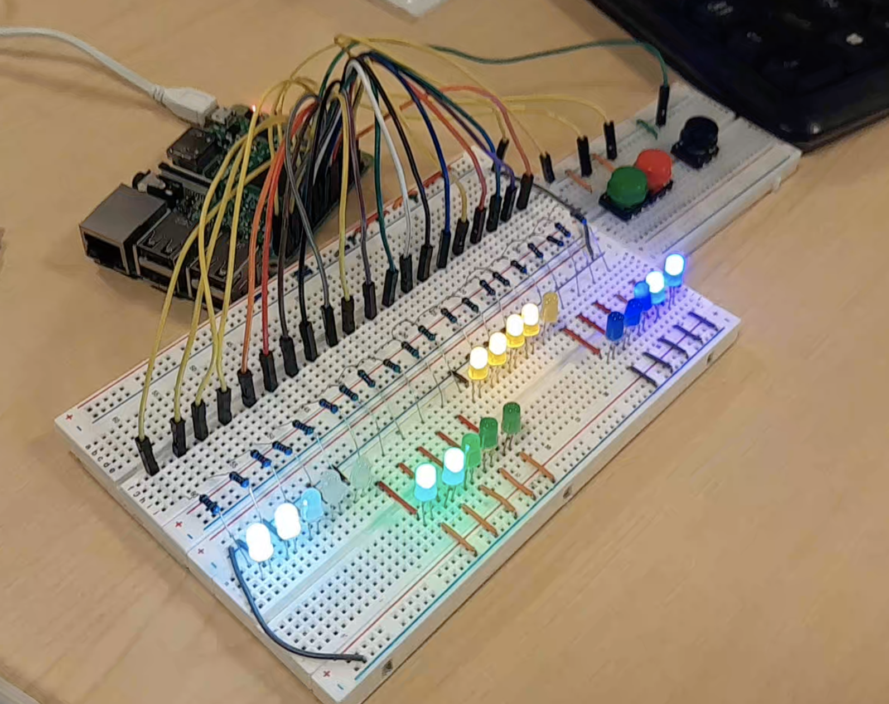

# Bare-Metal Nim on Raspberry Pi 3B

A bare-metal implementation of the game **Nim** for the **Raspberry Pi 3B**, played using LEDs and push-buttons connected through a breadboard. The program is written in **C99**, compiled directly into a kernel image, and runs **without an operating system**.

*Our Breadboard Nim extension. The heaps contain 2, 2, 4, and 5 objects from left to right, with 3 objects selected in the right-most pile. The smaller breadboard contains the 3 input buttons.*

## Overview

Nim is a two-player game where players alternately remove objects from one of several heaps. On each turn, a player must remove at least one object, and all removed objects must come from the same heap. In this version, **taking the final object loses the game**.

Our implementation uses **4 heaps**, which begin with random sizes of **2, 4, or 5**. Players use the two left buttons to choose a heap and the number of objects to remove, then press the right-most button to confirm the move. LEDs display the current heap sizes and blink to indicate the current selection. When the game ends, the LEDs display the winner and the game can be restarted.

## Implementation

The extension was implemented as a bare-metal Raspberry Pi program compiled directly into a binary kernel using the **aarch64-none-elf** toolchain. This allowed direct GPIO control without relying on external libraries, although it made debugging more challenging.

Each LED and button is wired to an independent GPIO pin on the Raspberry Pi and to the breadboard ground rail, which is connected back to a ground pin on the Pi. Each LED uses a physical resistor, while the buttons use the Raspberry Pi's internal pull-up resistors.

The main function in `nim.c` uses a forever loop containing:
- one loop for playing the game
- one loop for displaying the winner of the previous game

Each iteration checks button input, updates the game state, and renders the LED state when needed.

### Code structure

- `nim.c` - main game loop
- `gamestate.c` - game logic, including move application, selection changes, win detection, and end-screen behaviour
- `pins.c` - low-level GPIO access and hardware abstraction
- `nim_utils.c` - LED rendering and button handling
- `nim.h` - constants, enums, and shared structures

The `GameState` structure stores the current player, pile counts, and current selection. A separate `PinsState` structure stores the GPIO pin number for each hardware component.

In `pins.c`, memory-mapped GPIO access is handled through `volatile` pointers to the relevant hardware addresses. These functions are used to set pin modes, read input values, write output values, enable pull-up resistors, and access system time.

`nim_utils.c` builds on this lower-level functionality. In particular, `check_button_press()` handles button debouncing and avoids registering multiple inputs for a single press. We chose to apply button actions on release, and debounce by requiring a fixed delay after the initial press.

## Testing

Testing was split into two parts:

1. **Automatic tests for game logic**
2. **Physical play-testing on the hardware**

Under `tests/extension_tests`, a simple test program and Makefile run roughly a dozen tests on the functions in `gamestate.c`. These tests verify game-state transitions such as pile selection, move application, and win detection.

Testing the hardware interaction had to be done directly on the Raspberry Pi. While faults such as unlit LEDs or unresponsive buttons were often obvious, diagnosing their causes was difficult because there were no operating-system debugging tools available.

## Challenges

Most of the major challenges came from running the program on the Pi itself rather than from the game logic.

- Early versions of the breadboard circuit had wiring issues, including incorrectly connected buttons and LEDs that had failed from prior use.
- We initially overlooked the Raspberry Pi's built-in pull-up resistors and had to revise the button setup accordingly.
- Rendering LEDs at the end of every main-loop iteration caused incorrect blinking behaviour; this was fixed by introducing a `needs_render` flag and only re-rendering when input was detected or after a timed interval.
- Compiler optimisations interfered with memory-mapped GPIO access, which we resolved by disabling those optimisations.
- An end-screen bug caused the winner display to crash or be skipped; this was fixed by explicitly clearing all LEDs before entering the end-screen loop.

Although many of the fixes were simple in hindsight, diagnosing them on bare metal without standard debugging support often took significant time.

## Project context and contributions

This project was developed as an extension to a group ARMv8 and breadboard systems project, and is shared here through our group GitHub organisation.

For the Breadboard Nim extension, work was completed collaboratively across the group. Individual contributions were as follows:

- **Andrii Karach** - completed the main function, refined core game logic, and helped build the breadboard circuit
- **Qun Yang** - designed the base structure of the game and implemented many of the hardware helper functions
- **Shin Ju Kim** - wrote the automated test suite for the game-state functions and refined the Makefile for the extension
- **Gisele Yew** - implemented the logic for `init_game()`

All members contributed to the overall development, testing, and debugging of the extension.